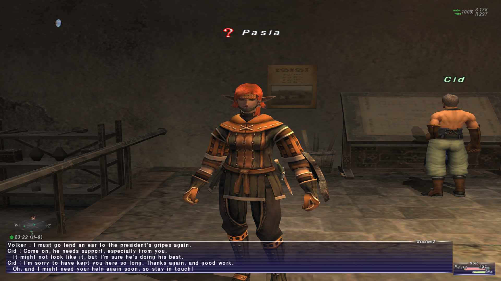

Premièrement, un peu de contexte.
Aux alentours de la sortie de *Final Fantasy XIV: Endwalker* (soit, en novembre 2021), j'ai été pris de l'envie de (re)faire tous les épisodes numérotés de la série des *Final Fantasy*
Suite à la massive déception qu'a été ma partie de *Final Fantasy XI*, j'ai beaucoup de choses à dire.
Accrochez-vous : il y a beaucoup de points à discuter.
Si vous voulez mon avis sur les autres opus de la série, je vous ramène vers la [page appropriée](index.html).

J'ai profité d'une réduction importante sur le jeu au courant du mois d'août.
Deux semaines plus tard (en ne jouant pas tous les soirs), j'ai laissé tomber le jeu.
La raison principale peut se résumer en un seul mot : grind.
Il faut farmer tout, tout le temps.
Pour monter en niveau ? Il faut tuer des ennemis en boucle.
Pour débloquer un nouveau job ? Il faut tuer des ennemis, récupérer des objets ou d'autres quêtes de ce style.
Même réussir à se connecter pour la première fois est un calvaire...

Mon avis va commencer par le début du jeu, à savoir mon ressenti après avoir réussi à me connecter, à créer mon personnage et à me lancer en Vana'diel.
Ensuite, on parlera de l'interface utilisateur.
TODO: finir structure
Chaque section commencera par un résumé des points positifs, négatifs ou neutres.
Le corps du texte rentre en détail pour certains de ces points.

Avant de rentrer dans le vif du sujet, je précise que j'ai essayé de prendre le jeu pour ce qu'il est.
Autrement dit, je ne m'attendais à jouer à *XIV*.
J'espérais une expérience différente et, sur ce point-là, je n'ai pas été déçu.
Certaines comparaisons avec d'autres jeux (hors de la série) vont être faites.
Typiquement, dans les parties sur l'exploration et les quêtes, des parallèles avec la série des *The Elder Scrolls* vont être faits.

## Début
  - Points positifs :
    - La découverte du jeu est agréable. On se sent directement plongé dans un autre monde.
  - Points neutres :
    - La configuration graphique doit se faire dans un exécutable à part.
      Vu l'âge du jeu, je ne tiens pas rigueur de cet artefact du passé.
  - Points négatifs :
    - [Inscription à *PlayOnline*.](#lancer-le-jeu)
    - [Création du personnage.](#créer-son-personnage)

### Lancer le jeu
Commençons donc par le commencement.
Pour pouvoir jouer à *Final Fantasy XI*, il faut :

  - Acheter le jeu sur la boutique de *Square Enix* (ou *Steam*, peu importe).
    Notez que les versions consoles n'existent plus.
    De même, seules les versions japonaises et anglaises sont encore accessibles.
    Dans mon cas, j'ai pris la version anglaise.
  - Créer un compte *PlayOnline* et le lier à son compte *Square Enix*.
    C'est ennuyant de devoir passer par plusieurs interfaces (complètement différentes) juste pour créer un compte.
    Si vous voulez savoir toutes les étapes, c'est documenté dans [une des pages officielles](http://www.playonline.com/homeeu/polshift/).
    Au final, on a donc un identifiant et un mot de passe pour le compte *Square Enix*, ainsi qu'un identifiant, un mot de passe, un nom d'utilisateur et un profil pour *PlayOnline*.
    Intuitif, non ?
  - Se battre avec le client pour qu'il reconnaisse le compte nouvellement créé.
  - Naviguer jusqu'à la page d'accueil du jeu (voir liste suivante) et lancer le téléchargement du jeu.
  - Attendre plusieurs heures parce que, bien évidemment, le jeu télécharge un fichier à la fois et depuis des serveurs peu performants.

Maintenant, les étapes à reproduire à chaque fois qu'on veut lancer le jeu (il est possible que j'inverse ou oublie certains étapes) :

  - Lancer le client *PlayOnline*.
  - Rentrer son identifiant et son mot de passe (ainsi que le mot de passe à usage unique, si configuré).
    Attention, on utilise les identifiants du compte *Square Enix* (de mémoire).
  - Attendre que le client charge la page d'accueil.
  - Cliquer sur le bouton *Final Fantasy XI*.
  - Attendre que le client charge la page du jeu.
  - Cliquer sur le bouton pour démarrer le jeu.
  - Le client affiche le statut PEGI.
  - Le client se ferme et l'exécutable du jeu démarre.
  - Le jeu affiche un message pour rappeler de sortir prendre l'air et voir ses amis de temps en temps.
  - On arrive (enfin) sur l'écran titre. Là, on peut sélectionner ou créer un personnage.

### Créer son personnage
Sélectionner son personnage se fait facilement.
Je n'ai rien à dire de particulier.
Par contre, la création du personnage est assez désagréable pour une simple raison : en fonction de la race et du genre, une animation se lance où le personnage court sur une plaine.
Est-ce que vous imaginez réussir à régler le personnage comme vous voulez quand il bouge dans tous les sens et que vous n'avez aucun contrôle sur la caméra ?
Au bout d'un moment, j'ai choisi des paramètres un peu au hasard.
Aussi, pour le réglage de la taille, il n'y a aucune indication qui permet de relativiser.
Je me suis retrouvé avec une elfe toute petite parce que j'ai cru que ce réglage-là permettait de changer son tour de poitrine, pas sa taille.
Au final, voici Pasia version *XI* :

Avant de passer à la suite, je tiens à préciser qu'il n'existe aucun moyen de changer la configuration du personnage.
Une fois Pasia créée, elle restera à l'infini comme elle est.
Pas de changement de coiffure, pas de *philtre d'illusion* à acheter (il n'y a d'ailleurs même pas de boutique en ligne).

Une fois la cité-état de départ choisie (dans mon cas, *Bastok* qui correspond à un mélange entre *Ul'dah* et *Limsa Lominsa* dans *XIV*), le début est plutôt sympathique, bien que très abrupt.
Le jeu te balance très rapidement dans le monde avec comme seule mission d'aller parler à un PNJ qui sert de tutoriel.
Celui-ci n'étant pas très passionnant (et on sent qu'il a été rajouté après la sortie du jeu), je ne vais pas en parler ici...

## Interface utilisateur
  - Points positifs :
    - Tout peut se faire au clavier.
      La souris est tout à fait optionnelle.
    - Beaucoup de commandes textes.
    - Le bouton pour cacher l'interface fonctionne jusqu'à ce que ce même bouton soit de nouveau pressé, contrairement à son équivalent dans *XIV*.
    - La carte présente une fonction pour lister les PNJs et ennemis aux alentours.
    - Le système de macros est très souple.
  - Points négatifs :
    - La carte du monde.
    - Tous les menus, surtout l'inventaire.
    - Charger le menu qui permet de lancer un combat instancié (nécessaire pour certaines quêtes) prend beaucoup trop longtemps.
    - Il faut attendre 30 secondes pour se déconnecter, même en ville.
      Seule la chambre personnelle permet de se déconnecter instantanément.
    - Les PNJs ont une fâcheuse tendance à avoir des accents.
      Le jeu n'étant pas doublé, il faut alors **lire** ces accents.

### Carte des zones
Cependant, pour trouver ce PNJ-tutoriel, il faut avoir une idée d'où il se trouve.
Le premier réflexe est d'ouvrir la carte, n'est-ce pas ?
Mais comment faire ?
Le bouton *M* ne fait rien...
En fait, il faut ouvrir le menu principal (en appuyant sur le *-* du clavier numérique par défaut) et sélectionner la carte par là.
Je n'ai pas trouvé de raccourcis pour ouvrir la carte rapidement.

Après un certain temps, je me suis donc renseigné sur les commandes textes et le système de macros.
Les deux sont très souples et offrent une grande gamme de fonctionnalités : changer de tenue, lancer une compétence, ouvrir la carte, etc.
Les macros sont groupées par livre et par ensemble.
Chaque ensemble contient une dizaine de macros quand on enfonce la touche *control* et une dizaine pour *alt*.
Le personnage possède 20 livres, chacun contenant 10 ensembles.
On a donc accès à 4000 macros différentes, ce qui est très généreux.

Une fois la carte ouverte, vous voyez ce genre d'écran :

C'est très épuré...
Probablement un peu trop.
Les chemins sont certes indiqués mais manquent de clarté.
De plus, dans certains endroits, la carte n'affiche pas si le chemin peut être emprunté ou non.
Parfois, après plusieurs minutes de marche, on tombe sur une porte fermée qui n'est pas indiquée sur la carte.
Par exemple, sur l'image ci-dessus, il y a en réalité deux parties complètement distinctes : la partie à l'est est beaucoup plus basse que celle à l'ouest.
Bien que la délimitation soit marquée par un trait foncé avec une ombre, ce n'est pas très clair si on peut passer d'une partie à l'autre (on ne peut pas, il faut changer de zone).

Cependant, il y a un point très positif lié à la carte : on peut chercher les PNJs et les ennemis dans les alentours.
Par exemple, si vous cherchez *Cid* et que vous savez dans quelle zone il est, vous pouvez faire un *Wide scan* pour lister les PNJs.
Quand vous aurez trouver son nom dans la liste, vous pouvez le marquer et un pointeur va apparaître sur la boussole (en bas à gauche de la photo de Pasia, plus haut).
La boussole est ridiculement petite mais cette fonctionnalité de recherche est excessivement pratique !

### Inventaires
Passons maintenant aux autres menus.
Je n'ai malheureusement pas fait de capture d'écran pour illustrer mes propos.
Je vais donc vous donner une idée du côté peu intuitif et très désagréable des menus : la gestion de l'inventaire.
En fait, vous avez plusieurs inventaires :

  - Les poches de votre personnage (qui peuvent être agrandies en faisant certaines quêtes).
  - Le stockage de votre maison.
    - Attention que les coffres que vous posez au sol et l'inventaire de la maison sont deux choses séparées.
  - Votre Mog personnel propose plusieurs inventaires à lui tout seul :
    - Un arsenal où stocker les armes et armures, accessible de n'importe où.
    - Un sac, accessible de n'importe où.
    - Un coffre-fort, accessible de n'importe où. Je n'ai pas vu de différence en jeu entre le soc et le coffre-fort à part que ce sont des entrées différentes dans le menu.
    - Et bien d'autres encore, accessibles en ville ou dans votre maison.
  - Dans les guildes des artisans, vous pouvez rencontrer des *Mogs éphémères* qui vous permettront de transférer les cristaux élémentaires de votre inventaire vers un espace dédié aux cristaux, et inversement.
    Vous ne pouvez pas faire cette opération sans parler à un tel Mog.

Est-ce que vous arrivez encore à suivre ?
Si non, c'est normal : c'est le bazar.
En tant que joueur, vous êtes supposés réussir à jongler entre tous ces emplacements différents.
Je ne vous dis pas quand vous essayez de ranger vos butins après un donjon...

Si vous désirez jouer au jeu, laissez-moi vous donner ce conseil qui m'avait échappé en début de partie : vous pouvez vous équiper de ce qui est dans l'arsenal du Mog.
Vos équipements ne doivent pas être dans votre inventaire personnel.
N'hésitez pas à exploiter ceci pour libérer pas mal d'espace !

### Dialogues
Finissons la partie sur l'interface avec les dialogues.
Ici, je ne veux pas parler de ce qui est dit mais plutôt de comment c'est dit.

Les dialogues s'affichent toujours dans la fenêtre de log.
Si vous voulez un exemple, vous pouvez aller regarder l'image de Pasia plus haut.
Vous y verrez la fin de la discussion qu'ont eu deux personnages durant une cinématique.
C'est un style très vieillot mais qui fonctionne bien, d'autant plus qu'on peut agrandir la fenêtre de log et remonter dans l'historique.
Autrement dit, tant qu'on ne se déconnecte pas, on peut relire les dialogues.
Plutôt pratique pour trouver son chemin selon les directions données.

Il y a un point qui a rendu la compréhension de certains dialogues compliquée : beaucoup de PNJs ont des accents ou des tics de langage dûs à leur race.
Par exemple, les pirates mâchent leurs mots, les *Tarutaru* (l'équivalent des *Lalafell* dans *XIV*) rajoutent des syllabes au milieu de certains mots, etc.
Ces particularités linguistiques servent à caractériser les personnages (même si c'est un peu facile et pas super intéressant) et ne rendent pas les dialogues incompréhensibles...
Mais pour un non-natif (comme moi), ces changements de langage font que certains dialogues importants demandent plus d'efforts pour être compris que sans.
À la longue, ça devient juste usant de devoir traduire ce que le PNJ raconte pour comprendre des phrases simples.

## Zones et exploration
  + Coffres
  - Vider le coffre
  + Objets temporaires
  - Objets avec lesquels on peut interagir ne sortent pas du décor
  + Voyage en avion/bateau se fait en temps réel et on voit le décor défiler. Comme on débloque ça bien après la téléportation, OK!
  * Est-ce que Castle Zvahl, le château du Seigneur des Ombres, sert à autre chose que la quête d'AF des BLM ? OUI
  + Il y a les os d'un vieux dragon (si j'ai bien compris) dans beaucoup de zone. Ça donne un côté très particulier aux zones
  - Les PNJs d'adjuration ont une existence physique. Il faut forcer pour passer à travers
  - Les PNJs d'adjuration se coincent facilement

## Quêtes et histoire
  + Tu n'es pas spécial. Tu es juste un aventurier qui se débrouille bien et qui est au bon endroit au bon moment
  + RoE
  - Trois journaux de quêtes
  - Les extensions se lancent toutes seules quand tu rentres dans une zone et que tu satisfais les conditions. Donc, pas forcément voulu.
    * On ne sait pas toujours ce qu'on regarde
  - Début de l'histoire pas intéressante
    * Il m'a fallu 30h de jeu (mission 4-1) pour arriver à une partie avec des vrais enjeux
  - Quête pour débloquer l'invocateur:
    * Farmer des sangsues pour obtenir un ruby de Carbuncle
    * Devoir visiter des zones (hors villes et hors donjons) pour voir certaines conditions météorologiques. Une fois les 7 vues, c'est bon.
      * Faits: rouge (chaud), orange (neutre), bleu (pluie), mauve (foudre), vert (vent)
    * Attention : il faut rentrer dans la zone. Si on y est déjà et que la condition météorologique s'enclenche, cela ne compte pas
  - Tenue relique:
    * Quêtes de farm dans des zones où tu es en-dessous du niveau recommandé
  - Une quête (nécessaire pour augmenter le niveau max) demande des récupérer des mots de passe... Qui changent tous les jours in game!
    * https://www.bg-wiki.com/ffxi/Whence_Blows_the_Wind
  - Si tu connais quelqu'un qui a déjà les objet-clés pour ouvrir les portes, tu peux ne pas devoir récupérer les clés... Ce qui veut dire qu'être ami avec quelqu'un qui a déjà passé un temps considérable te fait économiser du temps... Mais tu ne pourras pas le faire pour quelqu'un d'autre puisque tu n'auras pas récupéré les clés.

## Combat
  + Adjuration
    - Il faut les réinvoquer à chaque changement de zone
  - Cibler
  - Lancer un combat n'est pas toujours très réactif
  - La plupart du temps, ton personnage arrête le combat alors qu'il y a encore des ennemis aggressifs
  + Posture de soin hors-combat
    - Ticks très lents (surtout pour les MP)
  - Quêtes pour augmenter le niveau max...
    + À ne faire qu'une fois par personnage. Ce n'est pas lié au job.
  + Affinités aux armes et écoles de magie
    - Pas très clair, en jeu
  * Combat lent. J'imagine que ça a du sens quand tu es en équipe car ça laisse le temps de parler de la strat
    - Mais, seul, on s'ennuie
  + De ce que j'ai vu, les armures pour femmes ne sont pas des bikinis
  - Un design de super-boss qui est volontairement et ouvertement conçu pour punir les joueurs : https://www.youtube.com/watch?v=aaiZCZ0HY1w
  - Macros

## Jobs
  + Sous-job
    - Même si ça impose de monter un autre job juste pour récupérer ses compétences
  + Gain de niveau rapide (avec des bonus d'EXP faciles à avoir)
    - ... Pour les premiers niveaux. Ça ralentit vite et fort
  - Pénalité en cas de mort
  + Équipement de leveling partagé par beaucoup de jobs -> Moins de farm
  + Malgré le système de combat, il semblerait que chaque job a son propre rythme. Pour certains, il vaut mieux faire une grosse attaque peu souvent, pour d'autres (comme le DRG), il vaut mieux sortir plus souvent des attaques.
  * Mages (rouge, noir et blanc):
    * Les sorts s'achètent, comme dans les anciens FF
    - Mais, contrairement aux autres FF, farmer des monstres n'est clairement pas assez pour pouvoir s'acheter tous les sorts d'une école
    + Mage rouge n'est pas que mage blanc + noir, il a ses propres sorts. De plus, le RDM se spécialise dans les buffs/debuffs
    - Pas l'impression de faire des dégâts, en fait. Tu montes vite en niveau -> tes sorts sont inutiles
  * Dragoon:
    + Un dragon t'accompagne partout
    + Tu peux nommer ton dragon (selon une liste prédéfinie)
    + Le dragon fait une grosse attaque quand tu utilises une Weapon Skill

## Artisanat
  * Pas testé

## Global
  - Beaucoup de systèmes time-gated
    Au sens où la fenêtre pour l'action n'apparaît qu'une fois tous les huit heures, par exemple
  + Jobs emotes
  - Grind partout, tout le temps

## Musiques
  + Elles sont discrètes mais bien
  + Petit faible pour la musique de Jeuno
  - La musique de l'événement de commémoration

## Conclusion
Je comprends pourquoi la première version de FF XIV a été un échec.

Avis plus poussé : https://www.giantbomb.com/forums/final-fantasy-xi-online-684/i-spent-my-summer-playing-the-wrong-final-fantasy--1890703/ (P.S.: je ne suis pas d'accord avec l'auteur concernant FF XIII, par exemple. On est juste d'accord sur FF XI, je crois :p)

Des changements au fil du temps (on peut acheter les cartes et les sorts plutôt que de devoir faire des quêtes) mais sans changer les quêtes de base

Vous voulez l'histoire ? Allez lire https://www.finaland.com/?rub=ff11&page=scenario. Pour les quêtes de Bastok, c'est mieux raconté là qu'en jeu... Je suis plus motivé pour apprendre ce qu'il se passe en lisant qu'en jouant.

Vous voulez quand même jouer ? Si ça peut vous aider, j'ai grosso modo suivi le fil de ce guide : https://www.bg-wiki.com/ffxi/Quickstart_1-119_Guide... Sauf que je n'ai pas touché aux histoires des extensions (sauf le début de RoV pour avoir un Trust en plus et débloquer le sous-job plus facilement). Mauvaise idée ? Je ne sais pas.

Est-ce que ça irait mieux en jouant avec quelqu'un d'autre ? Pas sûr... Avec quelqu'un qui est déjà niveau 99 et qui a tous les objets-clés pour t'emmener dans les zones où tu dois ? Oui.