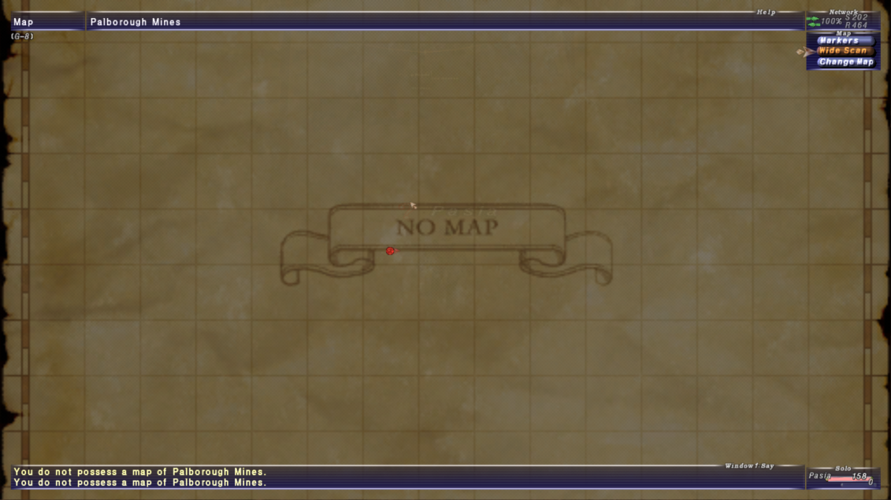
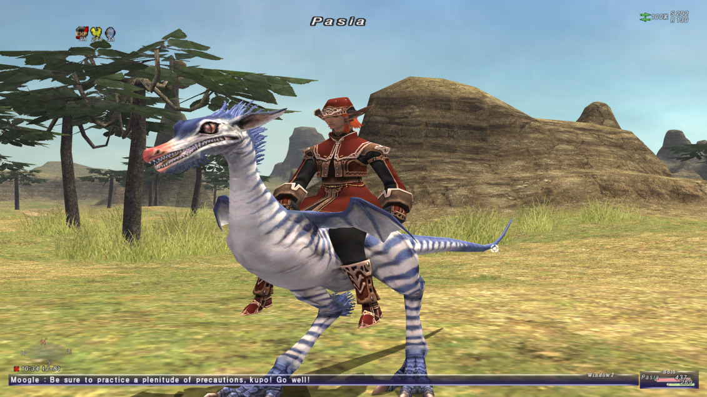

Premièrement, un peu de contexte.
Aux alentours de la sortie de *Final Fantasy XIV: Endwalker* (soit, en novembre 2021), j'ai été pris de l'envie de (re)faire tous les épisodes numérotés de la série des *Final Fantasy*
Suite à la massive déception qu'a été ma partie de *Final Fantasy XI*, j'ai beaucoup de choses à dire.
Accrochez-vous : il y a beaucoup de points à discuter.
Si vous voulez mon avis sur les autres opus de la série, je vous ramène vers la [page appropriée](index.html).

J'ai profité d'une réduction importante sur le jeu au courant du mois d'août.
Deux semaines plus tard (en ne jouant pas tous les soirs), j'ai laissé tomber le jeu.
La raison principale peut se résumer en un seul mot : grind.
Il faut farmer tout, tout le temps.
Pour monter en niveau ? Il faut tuer des ennemis en boucle.
Pour débloquer un nouveau job ? Il faut tuer des ennemis, récupérer des objets ou d'autres quêtes de ce style.
Même réussir à se connecter pour la première fois est un calvaire...

Mon avis va commencer par le [début du jeu](#au-commencement-était-playonline), à savoir mon ressenti après avoir réussi à me connecter, à créer mon personnage et à me lancer en Vana'diel.
Ensuite, on parlera d'une des grandes parties dans un J-RPG, à savoir [le combat](#de-la-baston), suivie immédiatement du [système de jobs](#travailler-pour-progresser).
On enchaînera avec [l'interface utilisateur](#le-dessous-des-cartes-et-des-menus) et [l'exploration des zones](#longue-promenade-à-travers-les-zones).
Pour finir les grosses sections en beauté, on dégustera [les quêtes et ce qui sert d'histoire](#le-désespoir-est-éternel-quêtes-et-histoire).
On finira avec [quelques points divers](#divers--artisanat-et-respect-du-temps), la [musique](#musiques) et, évidemment, [une conclusion](#conclusion).
Si vous désirez juste mon avis final, sautez directement à la fin.
Chaque section commencera par un résumé des points positifs, négatifs ou neutres.
Le corps du texte rentre en détail pour certains de ces points.

Avant de rentrer dans le vif du sujet, je précise que j'ai essayé de prendre le jeu pour ce qu'il est.
Autrement dit, je ne m'attendais à jouer à *XIV*.
J'espérais une expérience différente et, sur ce point-là, je n'ai pas été déçu.
Je me suis principalement concentré sur le jeu de base.
J'ai fait les premières quêtes de l'extension *Rhapsody for Vana'diel* (la dernière du jeu), histoire de pouvoir débloquer quelques objets de qualité de vie.

# Au commencement était PlayOnline
  - Points positifs :
    - La découverte du jeu est agréable. On se sent directement plongé dans un autre monde.
  - Points neutres :
    - La configuration graphique doit se faire dans un exécutable à part.
      Vu l'âge du jeu, je ne tiens pas rigueur de cet artefact du passé.
  - Points négatifs :
    - [Inscription à *PlayOnline*.](#lancer-le-jeu)
    - [Création du personnage.](#créer-son-personnage)

## Lancer le jeu
Commençons donc par le commencement.
Pour pouvoir jouer à *Final Fantasy XI*, il faut :

  - Acheter le jeu sur la boutique de *Square Enix* (ou *Steam*, peu importe).
    Notez que les versions consoles n'existent plus.
    De même, seules les versions japonaises et anglaises sont encore accessibles.
    Dans mon cas, j'ai pris la version anglaise.
  - Créer un compte *PlayOnline* et le lier à son compte *Square Enix*.
    C'est ennuyant de devoir passer par plusieurs interfaces (complètement différentes) juste pour créer un compte.
    Si vous voulez savoir toutes les étapes, c'est documenté dans [une des pages officielles](http://www.playonline.com/homeeu/polshift/).
    Au final, on a donc un identifiant et un mot de passe pour le compte *Square Enix*, ainsi qu'un identifiant, un mot de passe, un nom d'utilisateur et un profil pour *PlayOnline*.
    Intuitif, non ?
  - Se battre avec le client pour qu'il reconnaisse le compte nouvellement créé.
  - Naviguer jusqu'à la page d'accueil du jeu (voir liste suivante) et lancer le téléchargement du jeu.
  - Attendre plusieurs heures parce que, bien évidemment, le jeu télécharge un fichier à la fois et depuis des serveurs peu performants.

Maintenant, les étapes à reproduire à chaque fois qu'on veut lancer le jeu (il est possible que j'inverse ou oublie certains étapes) :

  - Lancer le client *PlayOnline*.
  - Rentrer son identifiant et son mot de passe (ainsi que le mot de passe à usage unique, si configuré).
    Attention, on utilise les identifiants du compte *Square Enix* (de mémoire).
  - Attendre que le client charge la page d'accueil.
  - Cliquer sur le bouton *Final Fantasy XI*.
  - Attendre que le client charge la page du jeu.
  - Cliquer sur le bouton pour démarrer le jeu.
  - Le client affiche le statut PEGI.
  - Le client se ferme et l'exécutable du jeu démarre.
  - Le jeu affiche un message pour rappeler de sortir prendre l'air et voir ses amis de temps en temps.
  - On arrive (enfin) sur l'écran titre. Là, on peut sélectionner ou créer un personnage.

## Créer son personnage
Sélectionner son personnage se fait facilement.
Je n'ai rien à dire de particulier.
Par contre, la création du personnage est assez désagréable pour une simple raison : en fonction de la race et du genre, une animation se lance où le personnage court sur une plaine.
Est-ce que vous imaginez réussir à régler le personnage comme vous voulez quand il bouge dans tous les sens et que vous n'avez aucun contrôle sur la caméra ?
Au bout d'un moment, j'ai choisi des paramètres un peu au hasard.
Aussi, pour le réglage de la taille, il n'y a aucune indication qui permet de relativiser.
Je me suis retrouvé avec une elfe toute petite parce que j'ai cru que ce réglage-là permettait de changer son tour de poitrine, pas sa taille.
Au final, voici Pasia version *XI* :

Avant de passer à la suite, je tiens à préciser qu'il n'existe aucun moyen de changer la configuration du personnage.
Une fois Pasia créée, elle restera à l'infini comme elle est.
Pas de changement de coiffure, pas de *philtre d'illusion* à acheter (il n'y a d'ailleurs même pas de boutique en ligne).

Une fois la cité-état de départ choisie (dans mon cas, *Bastok* qui correspond à un mélange entre *Ul'dah* et *Limsa Lominsa* dans *XIV*), le début est plutôt sympathique, bien que très abrupt.
Le jeu te balance très rapidement dans le monde avec comme seule mission d'aller parler à un PNJ qui sert de tutoriel.
Celui-ci n'étant pas très passionnant (et on sent qu'il a été rajouté après la sortie du jeu), je ne vais pas en parler ici...

# De la baston
Cette partie et [celle sur les jobs](#travailler-pour-progresser) sont fortement liées.

  - Points positifs :
    - [Le système d'adjuration](#pnjs-dadjuration).
    - En dehors des combats, il est possible de facilement régénérer ses points de vie et de magie.
      En appuyant sur une touche, le personnage se met à genoux et, tant qu'il est dans cette position, il va se soigner passivement.
    - Le personnage possède un niveau d'affinité par catégorie d'armes et de sorts.
      En utilisant une épée, par exemple, son affinité avec les épées va augmenter.
      Pour les armes, cela débloque des compétences plus puissantes et augmente les chances de toucher pour les sorts.
    - De ce que j'ai vu (mais j'insiste sur le fait que c'est une toute petite partie), les armures pour personnages féminins ne sont **pas** des bikinis.
  - Points négatifs :
    - Réussir à sélectionner sa cible.
    - [Déroulement d'un combat](#déroulement-dun-combat).
    - Le système de régénération de points de vie hors combat est très lent (surtout pour les PM).
    - Un design de super-boss qui est volontairement et ouvertement conçu pour punir les joueurs.
      Si vous désirez des informations, allez voir la vidéo de *Final Fantasy Union* sur [Absolute Virtue](https://www.youtube.com/watch?v=aaiZCZ0HY1w).

## PNJs d'adjuration
Une fois arrivé au niveau 5 avec n'importe quel job (ce qui se fait très rapidement), on peut faire une quête qui débloque le système d'*adjuration* (note : en anglais, ce système est appelé *trust*. J'utilise la même traduction que dans *XIV*.)
Au départ, on peut invoquer jusqu'à trois PNJs alliés qui participent aux combats.
Ce système est excessivement pratique, vu à quel point le jeu tourne autour du principe de coopération.
Les PNJs ont le même niveau que celui du personne qui les invoque, ce qui fait qu'ils sont pertinents à n'importe quel moment.
En avançant dans l'extension *Rhapsody of Vana'diel*, on peut débloquer le fait d'invoquer quatre, puis cinq alliés en même temps, rendant ce principe encore plus puissant.
Il y a cependant un point négatif majeur : à chaque changement de zone, il faut ré-invoquer tout le groupe, ce qui prend facilement 30 seconds, vu le temps d'attente entre deux sorts.

## Déroulement d'un combat
Afin de pouvoir donner un avis plus précis sur le système de combat, il faut d'abord que j'explique comment se déroule un combat :

  1. On cible un ennemi (les ennemis sont toujours visibles, comme dans *XII* ou *XIV*. Il n'y a pas de combat aléatoire).
  2. On lance le combat en cliquant sur un bouton dans le menu lié à la cible.
  3. Si le personnage est suffisamment proche, il va faire des attaques automatiques.
    Chaque attaque qui touche un adversaire remplit la jauge de *TP*.
  4. Une fois cette jauge de TP remplie, on peut activer une compétence (parmi celles débloquées pour l'arme actuellement utilisée).
    Cette compétence vide intégralement la jauge.
  5. Une fois l'adversaire occis, on passe au suivant.
  
Pour les jobs non-magiques, vous rajoutez le droit d'utiliser des objets et vous avez fait le tour de la boucle de gameplay.
Les mages, de leur côté, peuvent en plus lancer des sorts, ce qui consomme des PM.

C'est parti pour les points négatifs :
  - Lorsqu'on lance le combat (voir point 2), il y a très souvent un gros délai entre l'ordre et le lancement du combat en tant que tel.
    Pendant ce temps-là, on attend...
  - La plupart du temps, le personnage ne va pas cibler l'ennemi suivant, même si ce dernier est déjà en train de lui mordre les chevilles.
    À la place, il va ranger son arme et se dire que c'est bon, le combat est fini.
    Il faut donc sélectionner l'ennemi agressif, relancer le combat, etc.
    Un vrai plaisir quand il y a cinq ou six ennemis en face.
  - Globalement, les combats sont très lents.
    J'imagine que le but est de faciliter la coopération entre joueurs en laissant le temps de communiquer.
    Cependant, seul, on s'ennuie vite.

# Travailler pour progresser
Avant de donner la liste des points positifs, je dois préciser que, comme dans *XIV*, tout le système d'évolution et de montée en puissance du personnage passe par son job actuel.
Ceci veut dire que les statistiques sont régies par le job et le niveau de job.
Contrairement à *Final Fantasy V* (par exemple), il n'est pas question d'augmenter les statistiques de façon permanente.

  - Points positifs :
    - [Principe de sous-job](#un-deuxième-travail)
    - Pour les 30-40 premiers niveaux, le gain d'expérience est très rapide, surtout en exploitant les différents bonus donnés en jeu.
    - Pas mal de pièces d'équipement sont partagées par plusieurs jobs, ce qui réduit la quantité de pièces à devoir récupérer, au total.
    - Malgré le système de combat très rudimentaire, j'ai l'impression que les jobs ont leur propre identité.
      Pour certains, il vaut mieux faire une grosse attaque peu souvent, pour d'autres (comme le chevalier dragon), il vaut mieux sortir plus souvent des attaques.
  - Points négatifs :
    - Pour les niveaux après 40, le gain de niveau devient long et fastidieux.
    - En commençant le jeu, le niveau maximal est 50.
      Pour aller plus loin, il faut faire une quête tous les cinq niveaux.
      À noter que ces quêtes doivent être faites une fois par personnage.
      Une fois la quête pour aller jusqu'au niveau 55, tous les jobs peuvent atteindre ce palier.
      Je donne un exemple dans [la partie sur les quêtes](#le-désespoir-est-éternel-quêtes-et-histoire).
    - **En cas de mort, on perd une partie de son expérience.**

Après avoir parlé du système de sous-job, je vais me concentrer sur [les mages](#magie-colorée) et [le chevalier dragon](#chevalier-dragon), à savoir les jobs que j'ai testés.
  
## Un deuxième travail ?
En plus du job principal (qui régit les statistiques), on peut configurer un sous-job (ou job du support).
Ce sous-job ne va pas gagner d'expérience mais permet de débloquer les compétences et sorts accessibles pour ce sous-job.
Cependant, le niveau du sous-job suit deux contraintes :

  - Le niveau du sous-job ne peut pas dépasser le niveau de ce job.
    Par exemple, si on monte le chevalier dragon niveau 20, l'utiliser comme sous-job ne débloquera pas les compétences des niveaux supérieurs à 20.
  - Le niveau du sous-job ne peut pas dépasser la moitié du niveau du job principal.
    Par exemple, si un mage rouge de niveau 30 prend le voleur comme sous-job, ce dernier sera au maximum niveau 15.

Au final, on se retrouve donc à devoir monter un job secondaire (puisque le sous-job ne gagne pas d'expérience) juste pour récupérer ses compétences.
Si le gain d'expérience était activé, ça aurait pu être un chouette système !

## Magie colorée
Je vais ici parler des trois écoles de magie que j'ai testées : rouge, noire et blanche.
Même s'il existe d'autres jobs magiques, je ne les ai pas débloqués et je ne vais pas donc pas en parler.
Je vous invite à lire la quête pour débloquer l'invocateur décrite [plus bas](#en-quête-dinvocations) pour comprendre pourquoi je n'ai pas essayé d'en débloquer plus.

Premièrement, les magies ne se débloquent pas en fonction du niveau.
Comme dans les anciens *Final Fantasy*, il faut les acheter auprès de vendeurs spécialisés.
Ce système ne me dérange pas du tout.
Par contre, contrairement aux anciens jeux, les ennemis ne rapportent pas suffisamment de gils que pour pouvoir acheter tous les sorts facilement.
Autrement dit, il ne suffit pas de passer 10-20 minutes à tuer des ennemis autour d'un village pour récupérer tous les sorts.
C'est donc fastidieux de débloquer la véritable puissance d'un mage, ce qui ne facilite clairement pas sa prise en main, ni le gain de niveau.

Cette difficulté est renforcée par le fait que les sorts donnent l'impression de faire autant de dégâts que des pétards mouillés.
En fait, ils deviennent vite obsolètes et inefficaces.
Donc, tout le temps et les gils dépensés pour acheter ces sorts sont vite rendus inutiles.
Vraiment, ce jeu fait un travail incroyable pour faire ressentir des émotions négatives.

Ceci étant dit, j'ai quand même un point vraiment positif : le mage rouge n'est pas juste la fusion des mages blanc et noir.
Il a accès à des sorts spécifiques et se spécialise plus dans les buffs et debuffs que les deux autres écoles.
Je trouve ça agréable que des jobs qui suivent le même gameplay arrivent quand même à se distinguer par leur utilité.

## Chevalier dragon
Finalement, laissez-moi parler du dernier job que j'ai débloqué et monté : le chevalier dragon.
Visuellement, ce job est très agréable grâce à un petit dragon qui sert de familier et qui nous suit partout.
Le nom de ce dragon étant "personnalisable" (c'est-à-dire qu'il faut le choisir parmi une liste déjà définie) et ses animations plutôt sympathiques à l'œil, on s'y attache vite.
En plus, il aide vraiment en combat : à chaque fois qu'on active une compétence d'arme, il effectue aussi une grosse attaque de zone.
Du point de vue du gameplay, le chevalier dragon est vraiment bien (même si j'ai l'impression que le job n'évolue jamais en montant en niveau) !

Vous l'aurez peut-être compris dans ce que j'ai dit jusqu'à présent mais le système de combat et de jobs est, dans l'ensemble, assez bien (quand on commence le jeu. Je mets de côté les super-boss).
Mes problèmes viennent des autres parties du jeu.
Accrochez-vous pour la suite.

# Le dessous des cartes et des menus
  - Points positifs :
    - Tout peut se faire au clavier.
      La souris est tout à fait optionnelle.
    - Beaucoup de commandes textes.
    - Le bouton pour cacher l'interface fonctionne jusqu'à ce que ce même bouton soit de nouveau pressé, contrairement à son équivalent dans *XIV*.
    - La carte présente une fonction pour lister les PNJs et ennemis aux alentours.
    - Le système de macros est très souple.
  - Points négatifs :
    - [La carte du monde](#carte-des-zones).
    - [Tous les menus, surtout l'inventaire](#inventaires).
    - Charger le menu qui permet de lancer un combat instancié (nécessaire pour certaines quêtes) prend beaucoup trop longtemps.
    - Il faut attendre 30 secondes pour se déconnecter, même en ville.
      Seule la chambre personnelle permet de se déconnecter instantanément.
    - [Les PNJs ont une fâcheuse tendance à avoir des accents](#dialogues).
      Le jeu n'étant pas doublé, il faut alors **lire** ces accents.

## Carte des zones
Cependant, pour trouver ce PNJ-tutoriel, il faut avoir une idée d'où il se trouve.
Le premier réflexe est d'ouvrir la carte, n'est-ce pas ?
Mais comment faire ?
Le bouton *M* ne fait rien...
En fait, il faut ouvrir le menu principal (en appuyant sur le *-* du clavier numérique par défaut) et sélectionner la carte par là.
Je n'ai pas trouvé de raccourcis pour ouvrir la carte rapidement.

Après un certain temps, je me suis donc renseigné sur les commandes textes et le système de macros.
Les deux sont très souples et offrent une grande gamme de fonctionnalités : changer de tenue, lancer une compétence, ouvrir la carte, etc.
Les macros sont groupées par livre et par ensemble.
Chaque ensemble contient une dizaine de macros quand on enfonce la touche *control* et une dizaine pour *alt*.
Le personnage possède 20 livres, chacun contenant 10 ensembles.
On a donc accès à 4000 macros différentes, ce qui est très généreux.

Une fois la carte ouverte, vous voyez ce genre d'écran :

C'est très épuré...
Probablement un peu trop.
Les chemins sont certes indiqués mais manquent de clarté.
De plus, dans certains endroits, la carte n'affiche pas si le chemin peut être emprunté ou non.
Parfois, après plusieurs minutes de marche, on tombe sur une porte fermée qui n'est pas indiquée sur la carte.
Par exemple, sur l'image ci-dessus, il y a en réalité deux parties complètement distinctes : la partie à l'est est beaucoup plus basse que celle à l'ouest.
Bien que la délimitation soit marquée par un trait foncé avec une ombre, ce n'est pas très clair si on peut passer d'une partie à l'autre (on ne peut pas, il faut changer de zone).

Aussi, il faut acheter les cartes, sous peine de quoi on se retrouve avec cet écran :

Cependant, il y a un point très positif lié à la carte : on peut chercher les PNJs et les ennemis dans les alentours, y compris dans les zones dont on ne possède pas la carte.
Par exemple, si vous cherchez *Cid* et que vous savez dans quelle zone il est, vous pouvez faire un *Wide scan* pour lister les PNJs.
Quand vous aurez trouver son nom dans la liste, vous pouvez le marquer et un pointeur va apparaître sur la boussole (en bas à gauche de la photo de Pasia, plus haut).
La boussole est ridiculement petite mais cette fonctionnalité de recherche est excessivement pratique !

## Inventaires
Passons maintenant aux autres menus.
Je n'ai malheureusement pas fait de capture d'écran pour illustrer mes propos.
Je vais donc vous donner une idée du côté peu intuitif et très désagréable des menus : la gestion de l'inventaire.
En fait, vous avez plusieurs inventaires :

  - Les poches de votre personnage (qui peuvent être agrandies en faisant certaines quêtes).
  - Le stockage de votre maison.
    - Attention que les coffres que vous posez au sol et l'inventaire de la maison sont deux choses séparées.
  - Votre Mog personnel propose plusieurs inventaires à lui tout seul :
    - Un arsenal où stocker les armes et armures, accessible de n'importe où.
    - Un sac, accessible de n'importe où.
    - Un coffre-fort, accessible de n'importe où. Je n'ai pas vu de différence en jeu entre le soc et le coffre-fort à part que ce sont des entrées différentes dans le menu.
    - Et bien d'autres encore, accessibles en ville ou dans votre maison.
  - Dans les guildes des artisans, vous pouvez rencontrer des *Mogs éphémères* qui vous permettront de transférer les cristaux élémentaires de votre inventaire vers un espace dédié aux cristaux, et inversement.
    Vous ne pouvez pas faire cette opération sans parler à un tel Mog.

Est-ce que vous arrivez encore à suivre ?
Si non, c'est normal : c'est le bazar.
En tant que joueur, vous êtes supposés réussir à jongler entre tous ces emplacements différents.
Je ne vous dis pas quand vous essayez de ranger vos butins après un donjon...

Si vous désirez jouer au jeu, laissez-moi vous donner ce conseil qui m'avait échappé en début de partie : vous pouvez vous équiper de ce qui est dans l'arsenal du Mog.
Vos équipements ne doivent pas être dans votre inventaire personnel.
N'hésitez pas à exploiter ceci pour libérer pas mal d'espace !

## Dialogues
Finissons la partie sur l'interface avec les dialogues.
Ici, je ne veux pas parler de ce qui est dit mais plutôt de comment c'est dit.

Les dialogues s'affichent toujours dans la fenêtre de log.
Si vous voulez un exemple, vous pouvez aller regarder l'image de Pasia plus haut.
Vous y verrez la fin de la discussion qu'ont eu deux personnages durant une cinématique.
C'est un style très vieillot mais qui fonctionne bien, d'autant plus qu'on peut agrandir la fenêtre de log et remonter dans l'historique.
Autrement dit, tant qu'on ne se déconnecte pas, on peut relire les dialogues.
Plutôt pratique pour trouver son chemin selon les directions données.

Il y a un point qui a rendu la compréhension de certains dialogues compliquée : beaucoup de PNJs ont des accents ou des tics de langage dûs à leur race.
Par exemple, les pirates mâchent leurs mots, les *Tarutaru* (l'équivalent des *Lalafell* dans *XIV*) rajoutent des syllabes au milieu de certains mots, etc.
Ces particularités linguistiques servent à caractériser les personnages (même si c'est un peu facile et pas super intéressant) et ne rendent pas les dialogues incompréhensibles...
Mais pour un non-natif (comme moi), ces changements de langage font que certains dialogues importants demandent plus d'efforts pour être compris que sans.
À la longue, ça devient juste usant de devoir traduire ce que le PNJ raconte pour comprendre des phrases simples.

# Longue promenade à travers les zones
  - Points positifs :
    - Voyager par les airs ou par les mers se fait en temps réel et on voit le décor défiler.
      Il faut attendre que l'aéronef ou le bateau arrive à quai, monter dedans et attendre qu'il reparte.
      Comme ce système est débloqué bien après la téléportation, je trouve ça plutôt fun.
    - Dans certaines zones, il y a, si j'ai bien compris, les os d'un vieux dragon.
      Ceci donne un aspect très particulier et que j'apprécie.
  - Points neutres :
    - [Les montures](#montures).
  - Points négatifs :
    - [La téléportation](#téléportation).
    - Dans les zones, il y a des objets avec lesquels on peut interagir (parfois nécessaires pour des quêtes).
      Seulement, ils ne sont pas du tout visibles.
      On perd donc du temps à juste tourner en rond dans une zone et à marteler la touche pour changer de cible en espérant tomber sur ce qu'on cherche.
    - Les PNJs du système d'adjuration ont une existence physique.
      Il faut les contourner s'ils ont eu la mauvaise idée de se mettre sur le chemin qu'on veut emprunter (ce qui arrive couramment après un demi-tour).
    - De plus, ces PNJs se coincent facilement si le chemin n'est pas simple.
      Il y a un donjon où le sol est criblé de trous.
      Ce n'est pas un problème pour un joueur mais les PNJs se sont souvent retrouvés complètement coincés.

## Téléportation
Commençons d'emblée par quelque chose de positif : le système de téléportation d'un cristal à un autre n'est pas à débloquer.
On y a accès instantanément.
Cependant, de manière très très similaire au système des éthérites de *XIV*, il faut avoir interagi avec un cristal pour pouvoir s'y téléporter.
Pour moi, ceci fait tout à fait sens pour inciter les joueuses et joueurs à explorer.
Mon problème vient plutôt du fait que ces cristaux ne sont trouvables pratiquement que dans les villes.
Si vous désirez aller rapidement dans une zone hors-ville, il va falloir exploiter un autre système de téléportation...
Et il y en a un paquet :

  - Les cristaux.
  - Dans (quasiment) chaque zone se trouve un livre qui peut servir de point d'arrivée, une fois qu'on a interagi avec une fois.
  - Les Mages blancs ont accès à des sorts de téléportation qui peuvent être activés n'importe où vers des cristaux (distincts de ceux du premier point).
    Chaque cristal est lié à son propre sort, pour un total de 9 sorts.
    Comme pour les deux points précédents, en plus du sort, il faut déjà avoir interagi avec le cristal.
  - Si vous comptez les aéronefs et bateaux comme moyen de téléportation, on a un système en plus.

Et, ça, c'est juste pour le jeu de base.
Si vous rajoutez les systèmes rajoutés par les extensions, on arrive à 15 moyens de téléportation (hors aéronef/bateau) d'après [FFXIclopedia](https://ffxiclopedia.fandom.com/wiki/Category:Transportation).
En plus, tous ces systèmes sont indépendants : on ne peut sauter d'un cristal à un livre.
Autrement dit, le point de départ doit être du même type que le point d'arrivée.

Tout ceci fait que se déplacer rapidement est une plaie.
Il faut non seulement savoir **où** aller mais aussi (et surtout) **comment**, rendant le tout très complexe.
Cependant, pour être juste, ce type de complexité est présent dans d'autres jeux de cette époque, comme *The Elder Scrolls III: Morrowind* (qui est sorti la même année que *XI*).

## Montures
Il est important de noter que le jeu possède un système de montures.
Vu que j'ai arrêté peu de temps après avoir débloqué le droit d'appeler ma première monture, je ne me suis pas intéressé à savoir comment en débloquer.
Cependant, je tenais à partager cette image.

# *Le désespoir est éternel* : quêtes et histoire
  - Points positifs :
    - Le personnage principal n'est pas spécial.
      C'est juste un aventurier qui arrive à tirer son épingle du lot et qui est au bon endroit au bon moment.
      Je trouve que, dans un jeu en ligne, cela a plus de sens que d'être l'élu·e de la Lumière.
    - [*Records of Eminence*](#records-of-eminence), un système de quêtes qui te donnent des indications sur les grandes étapes à accomplir.
  - Points neutres :
    - Les extensions du jeu n'ont pas d'ordre.
      C'est bien pour celles et ceux qui veulent arriver dans le *endgame* mais je trouve ça peu agréable d'avoir tous les fils d'histoire en même temps.
  - Points négatifs :
    - Trois journaux de quête différents : les *Records of Eminence*, les quêtes secondaires et les quêtes principales des extensions.
      On s'y perd vite.
    - [L'histoire du jeu de base](#une-histoire).
    - Les extensions se lancent toutes seules dès qu'on remplit les conditions.
      Autrement dit, ce n'est pas voulu et on ne comprend pas ce qu'il se passe.
      Un changement de zone pour aller chez un vendeur et, paf, le jeu montre une fille qui prie devant un immense cristal.
    - Une grande partie des quêtes.
      Je donne [plus bas quelques exemples](#quelques-quêtes).
    - Certaines quêtes demandent des objet-clés pour ouvrir des portes.
      Les récupérer est une tâche pénible...
      Mais si on connaît quelqu'un qui joue au jeu et qui les a déjà, il peut nous ouvrir les portes et nous laisser avancer.
      Ceci veut dire qu'être ami avec quelqu'un qui a déjà passé un temps considérable fait économiser du temps...
      Mais, alors, on ne pourra pas le faire pour quelqu'un d'autre puisque on n'aura pas récupéré les clés.

## *Records of Eminence*
Dans un effort de donner des pistes des choses importantes à faire, le jeu inclut un ensemble de quêtes spécifiques.
Dans le tas, on trouve "Atteindre le niveau 30 avec tel job", "Débloquer tel job", "Débloquer la première monture", etc.
Donc, comme on se send perdu sans idée de ce qu'on devrait faire, regarder les missions disponibles dans les *Records of Eminence* donne des idées.
Remplir ces missions donne de l'expérience, un peu d'argent et, parfois, de la nourriture, de nouveaux PNJs d'adjuration, etc.
Ce système est vraiment bien, vu que les systèmes de jeu ne sont pas débloqués en avançant dans l'épopée (comme dans *XIV*) !
Pour accentuer l'intérêt, certains systèmes (comme le fait d'augmenter son niveau maximum) ne sont cités que dans ce carnet.
Donc, si vous jouez à *XI*, regardez régulièrement ce menu.

De plus, pour chaque zone contenant des ennemis, il y a une mission qui demande d'en tuer un certain nombre.
Ceci est très pratique quand on farm de l'expérience, puisque on va régulièrement avoir de l'EXP gratuit.

Le seul défaut est l'interface.
Les missions sont regroupées dans plein de catégories différentes.
C'est parfois un peu fastidieux de trouver la mission qu'on désire.

## Une "histoire"
L'histoire du jeu de base est nulle.
Je conçois tout à fait qu'un MMO ne désire pas mettre l'emphase sur son histoire, mais on attend une certaine qualité d'un jeu de la série *Final Fantasy*.
Il m'a fallu 30h de jeu pour arriver au début du "chapitre 4" qui commence enfin à poser des vrais enjeux.
Je comprends que le début soit lent pour qu'on puisse s'immiscer dans l'univers mais devoir aller crapahuter à travers de vastes zones pour tuer des hommes-bêtes sans comprendre le comment du pourquoi n'est pas très amusant.

De surcroît, le maigre fil d'histoire qui est raconté est confus et se base soit sur des flashbacks, soit sur des textes récités par les PNJs.
On ne vit quasiment rien par nous-mêmes.
Le concept du "This is my story" de *Final Fantasy X* est brûlé, découpé et jeté par la fenêtre.
Si on rajoute le fait que les extensions se lancent toutes seules, on ne comprend plus rien.
Par exemple, Shantotto (une puissante mage noire) intervient dans plusieurs histoires.
Seulement, une des extensions la fait partir du continent pour fonder son propre empire...
Et, après avoir vu cette cinématique, on peut quand même la voir dans des cinématiques des extensions antérieures.
Encore une fois, le jeu manque de cohérence.
J'insiste sur le fait que je ne parle que de l'histoire du jeu de base.
N'ayant pas avancé dans les extensions, je ne peux pas en parler.
Je vais juste dire que le jeu encourage fortement à avancer dans *Rhapsody of Vana'diel* vu toutes les fonctionnalités ou simplifications qui peuvent facilement être obtenues en complétant les chapitres.
Donc, le jeu pousse à faire le dernier contenu (qui se base sur tout ce qui est sorti avant) pour pouvoir avoir une expérience moins désagréable.
Bonne idée, non ?
Oh, et si vous voulez vraiment faire cette extension, sachez que vous serez obligé·e de quand même avancer dans les autres, certains chapitres demandant d'avoir accompli certaines quêtes.

Si vous désirez avoir une idée du scénario, je vous invite à lire le très bon résumé de [Finaland](https://www.finaland.com/?rub=ff11&page=scenario).
Honnêtement, c'est bien plus intéressant et excitant de lire ces pavés de texte que de vivre l'histoire.

## Quelques quêtes
Je vais maintenant parler de trois quêtes en particulier.
J'espère que mon style parviendra à transmettre l'exaspération qu'elles font ressentir.

### Limit break
Comme dit plus haut, il faut faire des quêtes pour augmenter le niveau maximal.
Dans l'idée, je trouve ça déjà pénible mais admettons.
Par contre, est-ce que c'était vraiment une bonne idée de faire une [quête](https://www.bg-wiki.com/ffxi/Whence_Blows_the_Wind) qui demande de récupérer des mots de passe...
En sachant que ces mots de passe changent **chaque jour en jeu** ?
Pour quelque qui concerne le gameplay le plus basique possible, est-ce que c'était vraiment nécessaire de [devoir récupérer trois objet-clés](https://www.bg-wiki.com/ffxi/In_Defiant_Challenge), tous dans des zones différentes et bien éloignées ?
Pourquoi est-ce que juste atteindre le niveau max doit être aussi pénible ?

### Même Gerolt serait dépité
Parlons un peu des armes et armures spécifiques à un job.
Rassurez-vous, cela ira vite car on peut résumer **ces** quêtes (oui, il y en a quasiment une par pièce) en quelques mots :

  - Devoir passer dans plein de zones pour trouver des clés, ouvrir des coffres, parler à des PNJs, etc.
  - Les pièces ont un niveau minimum pour être équipées.
    Par exemple, les chaussures demandent d'être niveau 52.
    Les ennemis dans les zones à traverser massacrent les personnages niveau 52.
    Un *délice*.
  - Certaines pièces ne sont, en vérité, pas des récompenses de quêtes.
    Ils sont dans des coffres dans des zones bien précises.
    Naturellement, **rien** n'indique où sont ces coffres.

### En quête d'invocations
Finissons par la meilleure quête : celle pour débloquer l'invocateur.
Voici les grandes étapes :

  1. Tuer des sangsues jusqu'à obtenir un *Cristal de Carbuncle*.
  2. Aller examiner une porte dans une des villes pour déclencher une cinématique avec un PNJ (ceci est indiqué dans les *Records of Eminence", heureusement).
  3. Observer les septs types de météo.
  4. Aller échanger le cristal à un point précis dans une zone précise pour (enfin) débloquer le job.

Ça n'a pas l'air trop horrible...
Parlons un peu plus en détail du point 3 :

  - Si la météo change quand on est dans une zone, ça ne compte pas.
    Il faut **rentrer** dans la zone tant que l'effet de météo est actif.
  - Rentrer dans une ville ou un donjon ne compte pas.
    Ce doit être une zone à ciel ouvert et où il y a des ennemis.
  - La probabilité d'avoir un temps chaud change selon le mois en jeu.
    C'est tout à fait logique qu'il fasse plus chaud en été, je ne dis pas le contraire, mais c'est pénible !
  - Le jeu n'indique pas les types de météo déjà vus.
    Il faut le mémoriser par soi-même.
    J'ai lu sur Internet (mais sans preuve) qu'on peut parfois voir un arc-en-ciel dans une des zones.
    Chaque couleur correspondant à un type de météo, celles déjà observées seraient mises en évidence.

Honnêtement, j'ai abandonné cette quête, par manque de motivation de juste attendre la bonne météo.
C'est dommage parce que le job avait l'air intéressant.
De ce que j'ai vu, les invocations participent activement au combat et ont des compétences spécifiques (Titan fera des dégâts élémentaires de terre, Odin de ténèbres, etc.).

# Divers : artisanat et respect du temps
  - Points positifs :
    - Chaque job a sa propre animation spécifique.
      Si vous voulez les voir, il y a [plusieurs vidéos sur YouTube](https://www.youtube.com/watch?v=-VGAwSVKCBc).
  - Points neutres :
    - Je n'ai pas testé sur le système d'artisanat.
      Je n'ai donc rien à dire.
  - Points négatifs :
    - **Énormément de systèmes sont "time-gated".**
      Je ne dis pas ça dans le sens où il faut attendre le résultat d'une action mais plutôt que la fenêtre pour effectuer une action n'apparaît qu'une fois toutes les huit heures, par exemple.
      Il n'est pas possible de se connecter à cette heure-là ?
      Pas de chance.
      Il faudra attendre la prochaine fenêtre.
    - Le jeu est un immense festival du grind.
      Tout doit être farmé, tout le temps.

Les deux derniers points négatifs m'amènent à dresser la conclusion suivante : **le jeu ne respecte pas le temps de ses joueuses et joueurs**.

# Musiques
  - Points positifs :
    - Les musiques sont globalement assez discrètes mais agréables à écouter.
    - J'ai un petit faible pour la musique du [duché de Jeuno](https://www.youtube.com/watch?v=CnNM2i_jeAo).
  - Points négatifs :
    - [La musique de l'événement d'été](https://www.youtube.com/watch?v=qQ-E_mZca9M).
      Imaginez cette musique en boucle pendant toute la nuit, dès que vous mettez le point dans une ville.
      Elle me rend dingue.

# Conclusion
Ma conclusion est très acide : **je comprends parfaitement pourquoi la première version de *Final Fantasy XIV* a été un échec.**
Quand les développeurs font des jeux qui crachent ouvertement à la tête de ses joueurs et joueurs, il est normal que les retours ne sont pas positifs.
J'ai même du mal à comprendre comment *Final Fantasy XI* a pu avoir du succès.
Pour moi, le jeu est rempli d'erreurs de game design.
Je comprends que le monde de MMORPGs était très différent en 2002 mais ça n'excuses pas le déplaisir immense que fait ressentir ce jeu.

Bien sûr, mon ressenti n'est pas celui de quelqu'un qui a lancé le jeu à sa sortie.
Toutes les extensions et les modifications apportées durant les 20 années de son existence ont énormément modifié le jeu.
Par exemple, au début du jeu, les sorts et cartes étaient des récompenses de quêtes.
Maintenant, il faut les acheter.
Le jeu évolue et "se simplifie" mais les quêtes et la progression du personnage en elles-mêmes ne font que se complexifier.
Comme il faut toujours augmenter sa taille, on se retrouve avec une pyramide de systèmes à devoir comprendre et maîtriser, ce qui est particulièrement désagréable quand on commence maintenant.
Quelqu'un qui a aimé le jeu en 2002 va probablement continuer à l'aimer maintenant mais je ne vois pas ce qui peut attirer de nouvelles personnes de façon durable.
Peut-être que jouer avec quelqu'un qui a déjà atteint le niveau max et qui a tous les objets-clés rendrait l'aventure plus amusante.
Honnêtement, c'est la seule façon de rendre ce jeu plus digeste, je pense...

Admettons qu'après avoir lu toutes ces lignes (merci !), vous ayez quand même envie d'y jouer.
Je ne peux que vous recommander de suivre un guide.
N'essayez pas d'y aller sans aide, je vous en conjure.
Même avec de l'aide, on se perd et on ne comprend pas grand chose.
Personnellement, je me suis basé sur [le guide 1-119 de bg-wiki](https://www.bg-wiki.com/ffxi/Quickstart_1-119_Guide).
Sauf que je ne l'ai pas suivi à la lettre.
Typiquement, je ne voulais pas commencer les extensions avant d'avoir fini le jeu de base, mon but étant de voir l'évolution de la série.
Je ne sais pas si c'était une mauvaise idée...

Voici donc ma conclusion finale : *Final Fantasy XI* est un **mauvais jeu qui ne respecte pas ses joueuses et joueurs**.